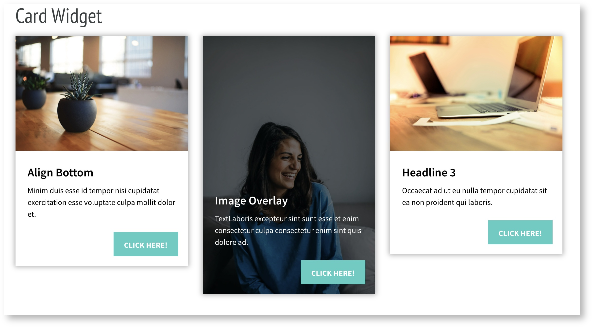

# Testaufgabe

Vielen Dank noch einmal für Dein Interesse an unserer Junior React CMS Stelle. Bevor es weitergeht, möchten wir Dich gerne bitten, eine Testaufgabe für uns zu lösen. Die Umsetzung soll voraussichtlich 1,5 Stunden dauern, sodass Du auch selber einschätzen kannst, wie gut Dein Wissensstand in React bzw. JavaScript, CSS und SASS ist.

## Aufgabenbeschreibung 

Um diese Testaufgabe erfolgreich zu bestehen, wird das CMS namens Scrivito benötigt. Dafür müsstest Du bitte als allererstes die Scrivito Example App bei Dir lokal einrichten.

1. Die Anleitung dafür ist auf der folgenden Seite zu finden: [https://github.com/Scrivito/scrivito_example_app_js]()
Hier findest du den passenden Start in die Dokumentation: [https://www.scrivito.com/a-brief-introduction-to-scrivito-10dd2c5367ac9f12]()

2. Du solltest per E-Mail eine Einladung tum Git bekommen haben. Checke auf deinem Rechner bitte folgende Git aus: [ssh://git@gitext.pinuts.de:20022/rumberg/testaufgabe.git]() und legen einen neuen Branch mit deinem Namen an. Kopiere dein lokal installiertes Scrivito in das Git und mache es lauffähig.

3. Dann programmiere bitte ein Card-Widget, dass ein Bild, eine Headline, einen Text und einen Call-To-Action Button kombiniert. Hier sind drei dieser Widgets jeweils in eine Spalte eines 4-4-4 Column-Widgets (gibt's schon im Scrivito) eingefügt:

| desktop | mobile |
| --- | --- |
|  |  |

### Mobile AnsichtMobile Ansicht
Überlege Dir also bitte, welche Attribute ein Redakteur benötigt, um diese Art von Inhalt erstellen zu können und erstelle das Widget möglichst nahe am Beispiel. Achte dabei bitte auf folgende Vorgaben:

- Das Card-Widget hat zwei Darstellungsvarianten:
    - "Gestapelt" mit dem Inhalt unter dem Bild
    - "Vollbild" mit den Inhalten als semi-transparentem Layer über das gesamte Bild
- Das gesamte Widget ist verlinkt
    - Der Inhalt soll sich jedoch nicht bei einem Hover wie ein Link verhalten (Farbe, unterstrichen)
- Beachte auch die Darstellung in einer mobilen Version
    - Größen
    - Abstände
- Versuche möglichst, bereits vorhandene Funktionen und Konzepte wieder zu verwenden.

## Viel Erfolg bei der Lösung der Testaufgabe! 
